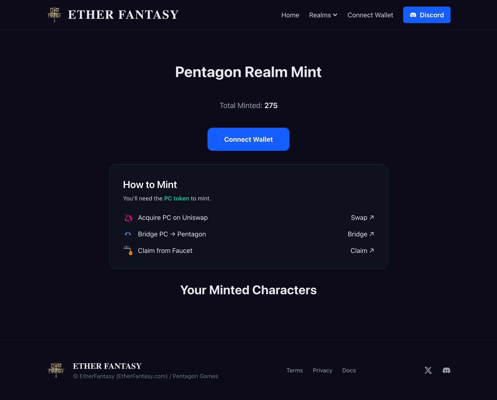
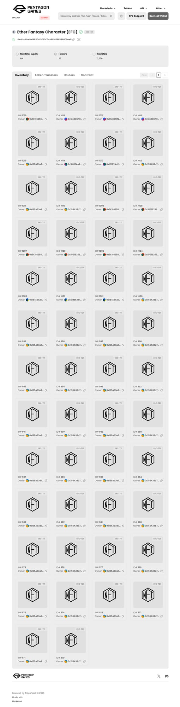

# EtherFantasy x USDC: Cross-Chain Minting Guide

> **Pay USDC on any chain. Mint on Pentagon Chain.**

This guide demonstrates how EtherFantasy enables seamless cross-chain NFT minting using USDC payments.

---

## The Innovation

Traditional NFT minting requires users to:
1. Hold native tokens on the target chain
2. Bridge assets manually
3. Pay gas in unfamiliar currencies

**EtherFantasy solves this:**
- Pay with USDC on Ethereum, Base, or Polygon
- NFT mints automatically on Pentagon Chain
- No bridging required — our backend handles cross-chain settlement

---

## Minting Flow

### Step 1: Visit Pentagon Realm

Navigate to [etherfantasy.com/pentagon](https://etherfantasy.com/pentagon)


- View total minted characters (275+)
- See available minting options
- Connect your wallet

---

### Step 2: Connect Wallet

Click "Connect Wallet" to open the connection modal.


Supported wallets:
- MetaMask
- WalletConnect
- Binance Wallet
- 580+ other wallets via WalletConnect

---

### Step 3: Select Payment Chain

Choose your preferred USDC payment chain:


**Supported chains:**
- **BASE** — Low fees, fast confirmation
- **Ethereum** — Maximum security
- **PC** — Native Pentagon Chain

Price: **1 USDC** per character mint

---

### Step 4: Bridge USDC (Optional)

> 🟢 **LIVE: USDC bridge path enabled!**

Already have USDC on Ethereum? Bridge directly to Pentagon Chain:


**Supported tokens on bridge.pentagon.games:**
- ETH
- PentagonChain (PC)
- Tether USD (USDT)
- **USD Coin (USDC)** ✅
- Pentagon (PEN)

---

### Step 5: Confirm & Mint

1. Review transaction details
2. Approve USDC spend (if first time)
3. Confirm mint transaction
4. Wait for cross-chain settlement

---

### Step 6: Character Delivered

Your character NFT appears in your wallet on Pentagon Chain.



**Check your NFTs:**
- Explorer: [explorer.pentagon.games](https://explorer.pentagon.games)
- In-game: Character appears in EtherFantasy

### NFT Inventory (Live on Pentagon Chain)



**Ether Fantasy Character (EFC)** — ERC-721 collection with:
- 23 unique holders
- 2,276 total transfers
- Live on Pentagon Chain mainnet

---

## Technical Details

### Smart Contracts

| Chain | Contract | Purpose |
|-------|----------|---------|
| Pentagon | `0xdEca6be9e148504Fa3f3C2AbE61626F98B009ae5` | Character NFT |
| Base/ETH/Polygon | Payment Processor | USDC collection |

### Agent Integration

AI agents can mint programmatically:

```solidity
// Call with USDC approval
paymentProcessor.purchaseWithUSDC(characterId, amount);
```

See [agent.md](agent.md) for full integration guide.

---

## Why Cross-Chain USDC?

1. **User-friendly** — Pay in stablecoins, not volatile tokens
2. **Chain-agnostic** — Users stay on their preferred chain
3. **Gas-efficient** — Backend batches cross-chain settlements
4. **Agent-native** — AI agents can mint without chain switching

---

## Links

- **Website:** [etherfantasy.com](https://etherfantasy.com)
- **Pentagon Chain:** [pentagon.games](https://pentagon.games)
- **Discord:** [discord.gg/etherfantasy](https://discord.gg/etherfantasy)
- **Contract:** [View on Explorer](https://scan.pentagon.games/address/0xdEca6be9e148504Fa3f3C2AbE61626F98B009ae5)

---

*Built by Pentagon Games for the Circle USDC Hackathon 2026*
